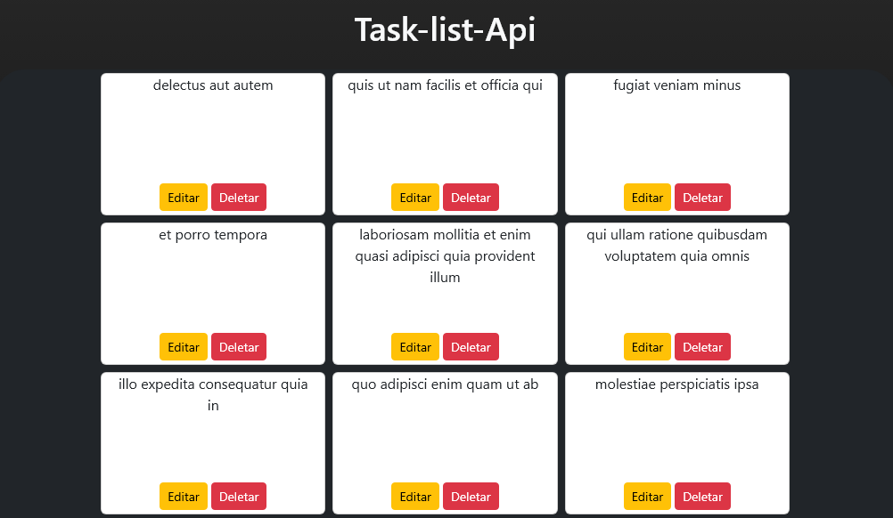

# Task List com API (React + Bootstrap)

Este projeto é uma **lista de tarefas (Task List)** construída com **React** e estilizada com **Bootstrap**, consumindo dados da API gratuita [JSONPlaceholder](https://jsonplaceholder.typicode.com/todos).

## ✅ Funcionalidades

- **[✔] READ** – Carrega e exibe as tarefas vindas da API.
- **[✔] UPDATE** – Simula a atualização de uma tarefa.
- **[✔] DELETE** – Remove a tarefa do estado local e envia uma requisição `DELETE` para a API.
- **[❌] CREATE** – Não implementado, pois a API JSONPlaceholder **não salva dados com POST** (apenas responde com sucesso, sem persistir).

> Este projeto implementa **3 de 4 operações CRUD**.

---

## 💡 Observações

- A API JSONPlaceholder é apenas para testes e **não realiza gravação real** de dados no servidor.
- Ideal para aprender e praticar `fetch`, `useEffect`, `useState`, componentização e estruturação de projetos com React + Bootstrap.

---

## 🚀 Próximos passos

- Criar uma **API própria** (com FastAPI ou Express) para ter um backend completo.
- Evoluir este projeto para um **e-commerce completo**, com login de usuário, painel admin e persistência real dos dados.

---

## 📸 Prévia

---

Desenvolvido por Marcus Lins
